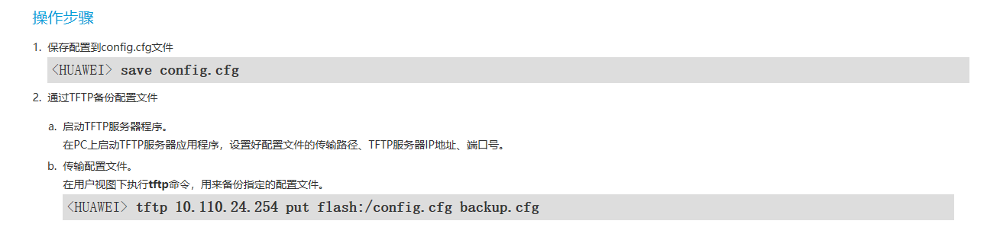
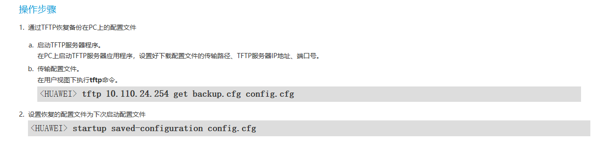

## 华为交换机常用操作命令

### 1、恢复出厂设置

```
用户视图下输入：reset saved-configuration；输入：Y，确认清除

输入：reboot；重启系统（第1次提示输入：N 不保存配置；第2次提示输入：Y 确认重启）
```

### 2、保存当前配置文件到默认存储设备中。

```
<HUAWEI> save
The current configuration will be written to the device.                        
Are you sure to continue?[Y/N]y                                                 
Now saving the current configuration to the slot 0..                         
Save the configuration successfully.
```

### 3、设置系统的日期、时间和时区

```
 clock timezone BJ add 08:00:00
 clock datetime 20:10:00 2012-07-26
```

### 4、配置Console用户界面的认证方式 

**方法一：采用aaa认证**

```
<HUAWEI> system-view
[HUAWEI] user-interface console 0
[HUAWEI-ui-console0] authentication-mode aaa
[HUAWEI-ui-console0] user privilege level 15
[HUAWEI-ui-console0] quit
[HUAWEI] aaa
[HUAWEI-aaa] local-user admin password cipher A1qazxsw2!@#
[HUAWEI-aaa] local-user admin privilege level 15
[HUAWEI-aaa] local-user admin service-type terminal
```

执行以上操作后，用户使用Console用户界面重新登录设备时，需要输入用户名admin，认证密码A1qazxsw2!@#才能通过身份验证，成功登录设备。

**方法二：采用密码认证【无需配置AAA】**

```
user-interface con 0
 authentication-mode password
 set authentication password cipher S[f1TS*$,E7jT$NR"EBC;uZ#
```

### 5、Telnet用户的级别和认证方式

```
[Server] telnet server enable
[Server] user-interface vty 0 4
[Server-ui-vty0-4] user privilege level 15
[Server-ui-vty0-4] authentication-mode aaa
[Server-ui-vty0-4] quit
[Server] aaa
[Server-aaa] local-user admin password cipher A1qazxsw2!@#
[Server-aaa] local-user admin privilege level 15
[Server-aaa] local-user admin service-type telnet
[Server-aaa] quit
```

### 6、备份配置文件



### 7、恢复配置文件

